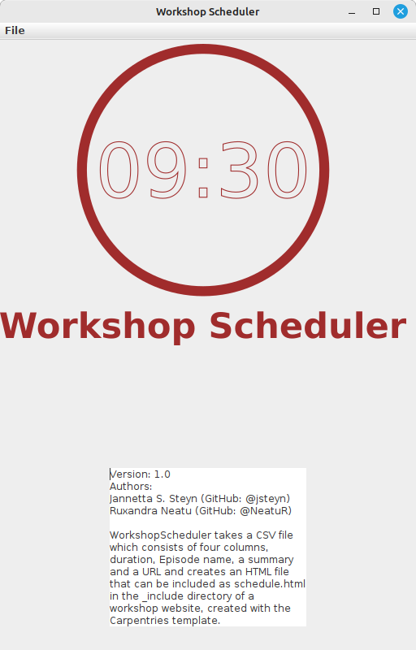
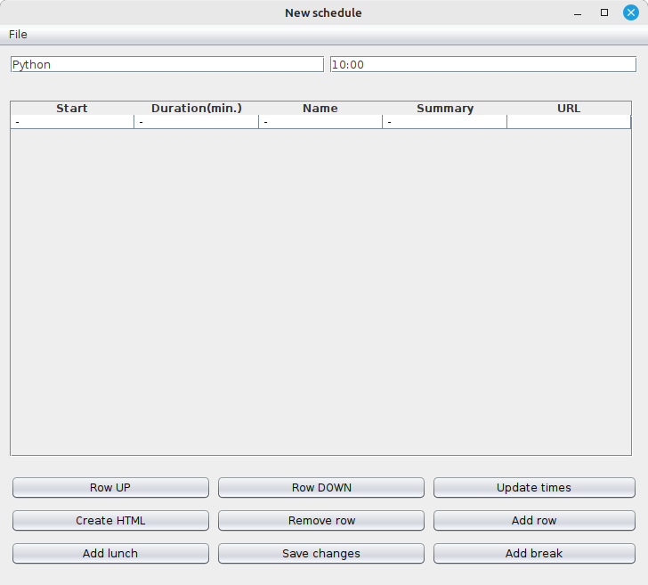
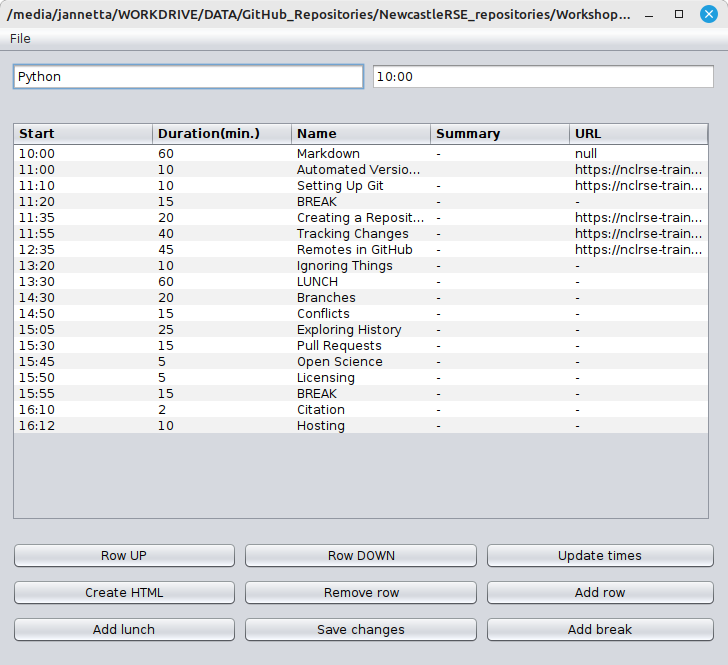

# User Manual

To run this program you will need Java 17 or later available on your computer. 
You will also need to download jws.jar or build it from this repository. 

You can run the program from the command or, if your file associations are set 
correctly, you should be able to run it from a File Explorer by double clicking on
the jwc.jar file.

To run the program from the command line:
- Navigate to the directory where your save jws.jar and type: `bash
java -cp jwc.jar com.jannetta.workshopscheduler.Main`

A splash screen (Figure 1) should open:

